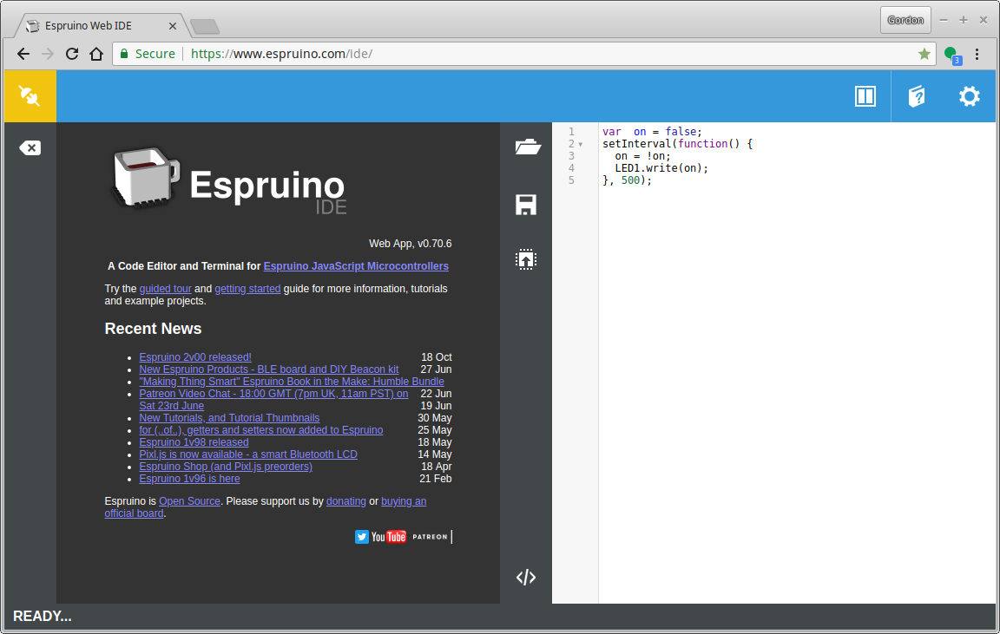
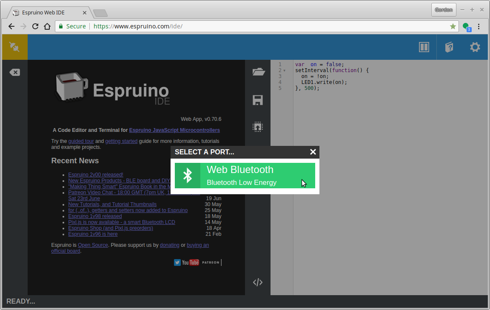
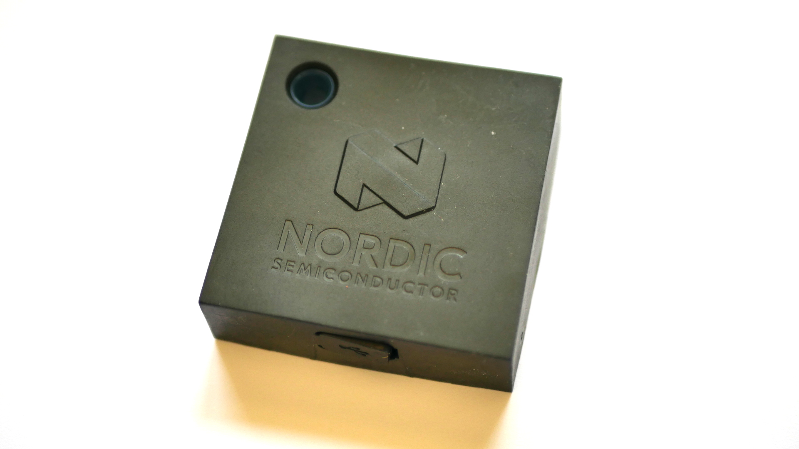
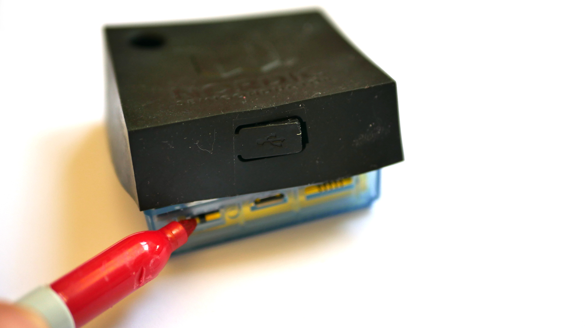
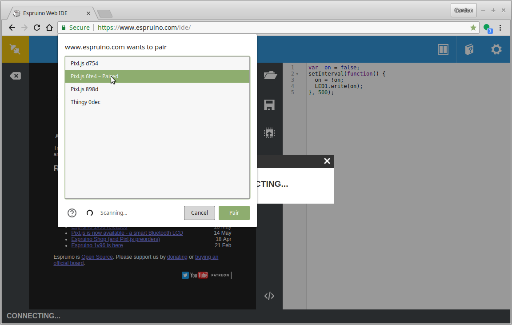
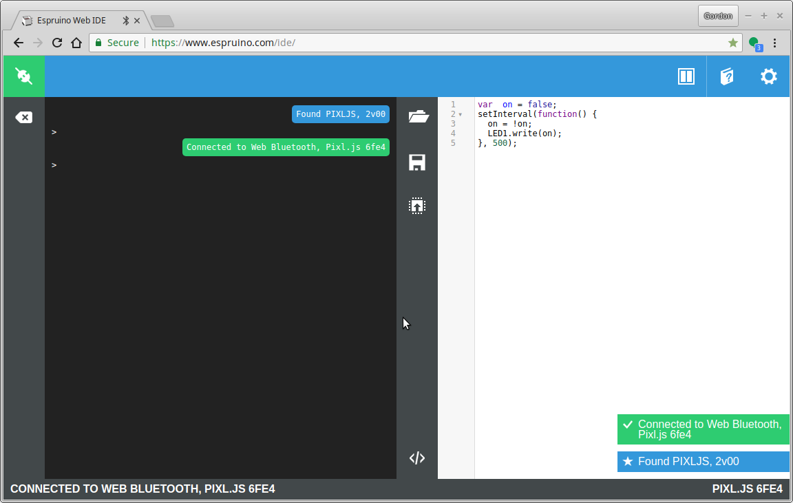

# Workshop: Web Bluetooth for IoT Sensors

In this workshop we'll figure out how to use Web Bluetooth to interact with
other devices - but also how to use Espruino on embedded devices to develop
our own Bluetooth-enabled hardware.

## Step 1 - Connecting

The first step is to connect to your Thingy:52 via Web Bluetooth.
We'll do this with the Espruino IDE.

* First, go to http://www.espruino.com/ide **in an up to date Chrome Web Browser**
* Click the connection icon in the top left

* You should see `Web Bluetooth` - if you don't, check out [Espruino's Guide](http://www.espruino.com/Quick+Start+BLE#with-web-bluetooth) and if there's nothing useful there, seek help. We have a few USB dongles that'll work on older Macs and PCs.

* Now it's time to set up the Thingy so you can connect to it.
* Peel the rubber case of the Thingy:52 back where the USB connector is, and flip the switch:

* Now put it close to your computer.
* Click the connect icon in the top left of the IDE again, and click `Web Bluetooth`
* You should see a bunch of devices - choose the one beginning with the word `Thingy `
which has the highest signal strength shown by it:

* Now you should be connected!

* On the left-hand side of the IDE is a REPL where you can enter commands. There's
Tab Completion which may help you.
* On the right-hand side there's an editor. Ctrl-Space will autocomplete, including documentation on the various functions available.
To upload code from the right-hand side, just click the 'Upload' button right in the middle of the IDE.

## Other stuff...

If you're interested in playing with Espruino further...

* Try the simple on-screen tutorial by clicking the book in the top right of the IDE,
followed by `Tutorial`
* See the normal Espruino intro at http://www.espruino.com/Quick+Start+Code
* Check out the Thingy:52 documentation and tutorials: http://www.espruino.com/Thingy52
* Try the Graphical code editor - go to the Web IDE `Settings`->`General` and turn on `Nordic Thingy:52` under `Graphical Editor Extensions` - then click the `</>` icon at the bottom of the Web IDE window.

## Web Bluetooth Steps...

If the IDE at http://www.espruino.com/ide worked for you then great,
you're sorted!

If it didn't and it couldn't be made to work, but you can get Node.js and [Noble](https://github.com/noble/noble) working then
you can use [the Web Bluetooth wrapper for Node](https://www.npmjs.com/package/webbluetooth)
to follow along with more or less the same code (you can also use the
[Espruino command-line tools]((https://www.npmjs.com/package/espruino)) to communicate with the Thingy:52.

## [Step 2 - Advertising](step2.md)
