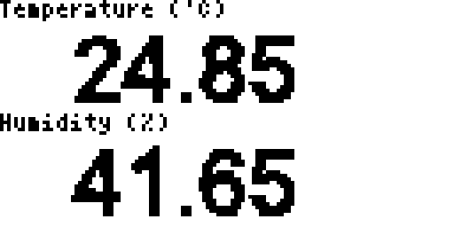

## Step 2 - Advertising

The most basic part of Bluetooth LE is advertising. So a device can be 'found'
and connected to (eg. appear in the 'Web Bluetooth' dialog), it broadcasts
a short message (31 bytes!) about itself. It does this a few times a second - there's no kind
of delivery response, so the packets can get lost - but eventually some will
get through.

It's a nice, easy, unauthenticated one-to-many way of transmitting data. Apart
from security, the only downside is that the receiver needs to keep listening
on the radio for packets, which uses a lot of energy.

**I've set up a device that broadcasts its name as `ENV`, along with the current Temperature and Humidity.**

### UUIDs

We only have 31 bytes - that's not a lot - in fact the whole of Bluetooth LE
is a bit constrained. As a result, the folks defining the spec decided to
do something to save space:

Pretty much everything in Bluetooth LE is described by a UUID. Common things,
or things that people are willing to pay a lot of money to the Bluetooth SIG
for are described by nice, compact 16 bit UUIDs. There are also 32 bit UUIDs that
nobody uses much, and finally there are 128 bit UUIDs - which are completely free.
Create a randomish number (`date|md5sum`), and you're good to go.

However 128 bit UUIDs are 16 bytes. This isn't a big deal for an actual connection,
but in advertising you rarely want to use up over half of your 31 byte budget -
so for this example we're staying with some predefined 16 bit UUIDs. See the
note right at the end about Manufacturer data.

So - how do we see this data? Unfortunately while there is an addition to the
spec in development, Web Bluetooth doesn't yet let you read data from devices
advertising it.

### Use your phone

(Optional...) Go to your Phone's app store and search for `NRF Connect` by
`Nordic Semiconductor`. This is an app created to help you debug Bluetooth LE devices.

* Start it, make sure `Scanner` is selected, and hit `Scan` up the top right.
* You should see a whole bunch of devices that are owned by people in the room
* You should see a device called `ENV` (you can also filter by name if too
  many devices appear).
* Tap on the device, and you should see information about it reported - including
the Temperature (which the app can decode) and Humidity as `0x2A6F` (which it can't).

### Use the Thingy:52

Since you're hopefully still connected to the Thingy:52, you can ask it to scan
for devices. There are a few ways to do this....

* [`NRF.setScan(callback(device), options)`](http://www.espruino.com/Reference#l_NRF_setScan) will
call a function for every received advertising packet.
* [`NRF.findDevices(callback(devices), options)`](http://www.espruino.com/Reference#l_NRF_findDevices) will
listen for a set interval (2 secs default) and will call the function with all the devices found.
* [`NRF.requestDevice(filter) => promise(device)`](http://www.espruino.com/Reference#l_NRF_requestDevices) is
Espruino's version of the [Web Bluetooth `navigator.bluetooth.requestDevice`](https://developer.mozilla.org/en-US/docs/Web/API/Bluetooth/requestDevice)
which we'll come to later. It finds one device matching the filters, and completes the promise with it.

Given we're in a room with a million Bluetooth LE devices, to make things easy
we won't use the first two functions. We'll use `requestDevice`, which is fast
and efficient.

Copy the following code and paste it on to the left-hand side of the IDE.

```
NRF.requestDevice({filters:[{name:"ENV"}]}).then(device => {
  console.log("Found device");
  console.log(device);
}).catch(err => {
  console.log("There was a problem!", err);
});
```

You may see this (after a few seconds delay):

```
>NRF.requestDevice(...
=Promise: {  }
There was a problem! No device found matching filters
```

Which means that during the 2 second period of searching for devices, nothing
was found. Just use up-arrow to recall the previous command and enter to execute
and try again.

Everything going well, you should see something like this:

```
>NRF.requestDevice(...
=Promise: {  }
Found device
BluetoothDevice: {
  "id": "c0:03:88:c9:0d:ec random",
  "rssi": -29,
  "data": new Uint8Array([2, 1, 5, 5, 22, 110, 42, 157, 9, 5, 22, 111, 42, 86, 17, 4, 9, 69, 78, 86]).buffer,
  "name": "ENV",
  "serviceData": {
    "2a6e": new Uint8Array([157, 9]).buffer,
    "2a6f": new Uint8Array([86, 17]).buffer
   }
 }
```

* `id` is the MAC address of the device (there are different types of MAC address, `random` (locally unique) and `public` (unique in the world) - but we don't cover that here)
* `rssi` is the signal strength
* `data` is the raw advertising data that was received.
* `name` and `serviceData` are decoded data from the raw advertising packet.

`serviceData` contains the [16 bit Characteristic UUIDs](https://www.bluetooth.com/specifications/gatt/characteristics)
defined by the Bluetooth SIG, along with the data from them.

So, how do we get at our data? It's already been partially decoded for us into
an ArrayBuffer. All we need to do is use either a `DataView` or `Uint16Array` to
decode it into a 16 bit value again, and divide by 100:

```
NRF.requestDevice({filters:[{name:"ENV"}]}).then(device => {
  // Sanity checks
  if (!device.serviceData ||
      !device.serviceData["2a6e"] ||
      !device.serviceData["2a6f"]) {
    console.log("Corrupt advertising data");
    console.log(device);
    return;
  }
  // decode into an object
  var hum = {
    temperature : (new Uint16Array(device.serviceData["2a6e"]))[0]/100,
    humidity : (new Uint16Array(device.serviceData["2a6f"]))[0]/100
  };
  // display what we got
  console.log("Found device");
  console.log(hum);
}).catch(err => {
  console.log("There was a problem!", err);
});
```

Copy and paste into the left-hand side of the IDE and it'll produce:

```
> ...
=Promise: {  }
Found device
{ "temperature": 24.87, "humidity": 43.94 }
```
You could wrap it all up in a function, call it every few seconds using `setInterval`, and then do something like sound an alarm if the temperature went out of range.

... if you want to do something more interesting you could use an Espruino device with a display like [Pixl.js](http://www.espruino.com/Pixl.js) (or you could solder a display to a Thingy:52). I have a few Pixl devices at the front you can play with - and on a [Pixl.js](http://www.espruino.com/Pixl.js) you can run the following code to create a weather station:

```
function scan() {
  NRF.requestDevice({filters:[{name:"ENV"}]}).then(device => {
    // Sanity checks
    if (!device.serviceData ||
        !device.serviceData["2a6e"] ||
        !device.serviceData["2a6f"]) {
      console.log("Corrupt advertising data");
      console.log(device);
      return;
    }
    // decode into an object
    var hum = {
      temperature : (new Uint16Array(device.serviceData["2a6e"]))[0]/100,
      humidity : (new Uint16Array(device.serviceData["2a6f"]))[0]/100
    };
    // display what we got
    g.clear();
    g.setFontVector(20);
    g.drawString(hum.temperature, 20,8);
    g.drawString(hum.humidity, 20,40);
    g.setFontBitmap();
    g.drawString("Temperature ('C)", 0,0);
    g.drawString("Humidity (%)", 0,32);
    g.flip();
  }).catch(err => {
    // There was a problem - we don't care as we expect it sometimes...
  });
}

setInterval(scan, 10000);
scan();
```



Want to use Node.js to read the data? [There's some info about it here](http://www.espruino.com/Puck.js+Advertising)

### Do how do you broadcast?

All you need to do is call [`NRF.setAdvertising(...)`](http://www.espruino.com/Reference#l_NRF_setAdvertising)
with the services and data you wish to advertise (note that everything must
be a byte array. If you supply a string, it'll be converted to a byte array
for you).

The code I used is just as follows:

```
// Get humidity/temp readings from the Thingy
Thingy.onHumidity(function(hum) {
  // Bluetooth spec says data is 16 bits, 0.01/unit - so x100
  var t = Math.round(hum.temperature*100);
  var h = Math.round(hum.humidity*100);
  // Set advertising data and name
  NRF.setAdvertising({
    0x2A6E : [t&255,t>>8],
    0x2A6F : [h&255,h>>8],
  },{
    name:"ENV",       // change the name
    connectable:false // don't allow anyone to connect
  });
});

function onInit() {
  NRF.setTxPower(4); // Highest transmit power
}
```

You can do exactly this kind of thing on your Thingy, but note that
Advertising only works when the device **isn't connected to your PC**, which
makes it slightly more frustrating for a workshop!

### A note on Advertising data

Looking at the data we'd received, we have:

```
[2, 1, 5, 5, 22, 110, 42, 157, 9, 5, 22, 111, 42, 86, 17, 4, 9, 69, 78, 86]
```

The data is decoded as a series of:

* Byte Length (excluding the length)
* Type of data [from this list](https://www.bluetooth.com/specifications/assigned-numbers/generic-access-profile)
* Actual data

So the data above decodes as:

```
[2, 1, 5,  // 2 bytes, Bluetooth LE flags
5, 22, 110, 42, 157, 9,  // 5 bytes, Service Data, 0x2A6E + 2 bytes temperature
5, 22, 111, 42, 86, 17,  // 5 bytes, Service Data, 0x2A6F + 2 bytes humidity
4, 9, 69, 78, 86 ] // 4 bytes, Name, E..N..V
```

You're only supposed to use the Bluetooth SIG provided 16 bit UUIDs for service
data (and we have abused that somewhat by sending temperature and humidity
characteristic UUIDs). You can however make your own 128 bit UUIDs as described above, but
we have only 31 bytes of advertising data in total!

Obviously in that case Service Data is not ideal - so you can specify 'Manufacturer Data', which
uses a 16 bit UUID which you can get for free, but by registering with the Bluetooth
SIG. Espruino has it's own (`0x0590`) which can be used for whatever you want. See [`NRF.setAdvertising(...)`](http://www.espruino.com/Reference#l_NRF_setAdvertising)
for an example of using it.


## [Step 3 - Services and Web Bluetooth](step3.md)
