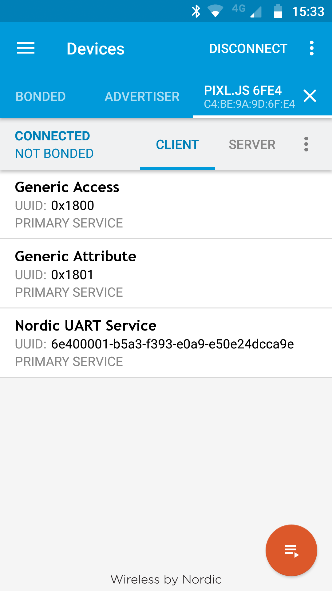
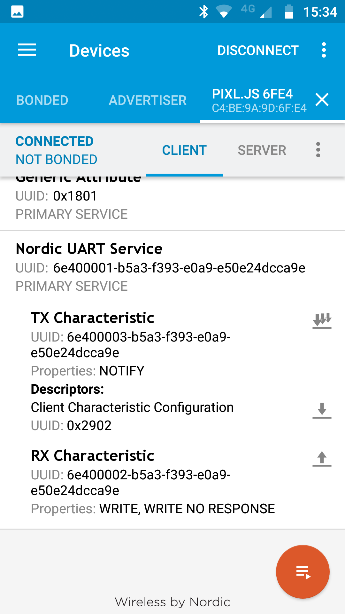

## Step 3 : Services and Web Bluetooth

So, we've seen a simple way to receive data from a Bluetooth device, but how
do you transmit (or 'push') data to one? With Bluetooth LE, you need to have
created a connection to a device to do that.

Bluetooth LE has some confusing terminology here:

* Peripheral/Server - This is the device that 'serves' up the characteristics,
like a smartwatch or a lightbulb.
* Central/Client - This is the device that initiates the connection to a Peripheral
or Server and sends it commands.


### Services and Characteristics

When you connect to a Bluetooth device, it advertises a bunch of 'Services' it
provides. These are described by a UUID (either 16, 32 or 128 bit).

For instance a wireless lightbulb may provide a 'light' service and a 'battery' service.

Each Service has Characteristics (also described as a UUID), which are basically like variables that can be:

* Read
* Written
* Set up for Notifications - this will tell the connecting device when the value has changes (Indications are almost the same sort of thing)

So for our wireless lightbulb example we might have:

* **Service:** Light
  * **Characteristic:** Brightness (writable, readable)
  * **Characteristic:** Hue (writable, readable)
* **Service:** Battery
  * **Characteristic:** Percent Charge (readable, notify)

You can have more than one of the same type of service or Characteristic, so
for example our wireless lightbulb may have two lights, or two batteries.

These can be a nightmare to figure out when trying to connect to a device with
code, so it really helps to use an app like `nRF Connect` (mentioned above)
to really dig into them...

### Nordic UART Service

The Bluetooth SIG defines [a bunch of standard 16 bit UUIDs](https://www.bluetooth.com/specifications/gatt/services)
that can be used, however one thing it doesn't define is a simple way to send
character data.

This is probably intentional, to stop people using it for everything instead
of defining services.

However that hasn't stopped Nordic Semi (who make the chips we're using) from
defining their own standard, called 'Nordic UART', using the 128 bit UUIDs.

This consist of one Service, and two characteristics:

* **Service:** UUID 6e400001-b5a3-f393-e0a9-e50e24dcca9e - Nordic UART
  * **Characteristic:** UUID 6e400002-b5a3-f393-e0a9-e50e24dcca9e - TX (notify)
  * **Characteristic:** UUID 6e400003-b5a3-f393-e0a9-e50e24dcca9e - RX (writable)

**A note on UUIDs:** While 128 bit UUIDs are 16 bytes, once a connection is established
the UUID is remembered - as long as you create one 'base' UUID of the form
`0000xxxx-0000-0000-0000-000000000000` and then change only the `xxxx` bit
it's pretty efficient - which is what Nordic have done above.

Espruino devices use a Nordic UART Service for their REPL - so
for instance this is what you see looking at an Espruino in the `nRF Connect` app:



And with the service 'expanded':




### Creating an HTTPS page

First, as a test that everything is working, we're going to use a simple library for Espruino called
[puck.js](http://www.espruino.com/Puck.js+Web+Bluetooth), which makes it easy to send text over the
Nordic UART Service. Then, we'll move onto bare Web Bluetooth.

Since the REPL is available over the Nordic UART, all we'll do is send JS
commands followed by a newline. For instance `'LED1.set();\n'` should turn
the LED on.

For security reasons, Web Bluetooth will only work from a webpage served over HTTPS (not from HTTP,
or a local file) and not from within an `iframe`, so we can't just use something
like [jsfiddle](https://jsfiddle.net/)

You may have your own arrangement (HTTPS on localhost) in which case use
whatever works for you, but here are the steps to use GitHub:

* Log in or create an account on [GitHub.com](https://github.com)
* Click on the `Repositories` tab, and click `New`
* Enter `PuckTest` as the name, make sure you check `Initialize this repository with a README`,
and click `Create` (if you don't, you'll have to use command-line tools to create a new file)
* Click on the `Settings` tab in the top right
* Scroll down to `GitHub Pages`, under `Source` choose `master branch` and click `Save`
* Now go back to the `Code` tab, and click `Create new file` in the top right
* Enter `test.html` as the name
* Now Copy and paste the following code and click `Commit new file` at the bottom:

```HTML
<html>
 <head>
 </head>
 <body>
  <script src="https://www.puck-js.com/puck.js"></script>
  <button onclick="Puck.write('LED1.set();\n');">On!</button>
  <button onclick="Puck.write('LED1.reset();\n');">Off!</button>
 </body>
</html>
```

You'll now have your own webpage at: https://your_username.github.io/PuckTest/test.html

Now...

* Make sure you have disconnected from your device using the Web IDE, but
leave your device connectable as detailed right at the start.
* Go to your Webpage URL, and click the `On` button
* If all goes well, you'll get  the Web Bluetooth window where you can select
you device
* Not working? Try [the version hosted on the Espruino site](https://www.espruino.com/try.php?page=Puck.js+Web+Bluetooth&n=0)
and see if that works.
* After a few seconds the red LED should light
* You can then click `Off` and `On` to toggle it
* Close the webpage to disconnect

More info about this [is on the Espruino site](http://www.espruino.com/Puck.js+Web+Bluetooth).


### Connecting from an Espruino device

You can connect from one Espruino device to another using a UART connection
as well. Check out http://www.espruino.com/Puck.js+BLE+UART for some
examples of doing that.


## [Step 4 - Web Bluetooth - Writing](step4.md)
